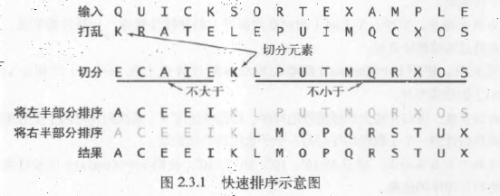
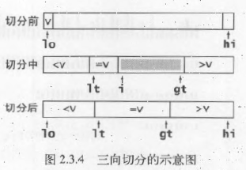
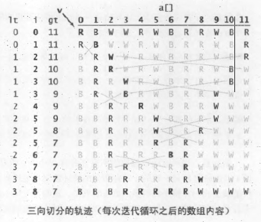

# 初级排序算法
## 插入排序
将每一个元素插入到其他已经有序的元素列表中的适当位置

为了给要插入的元素腾出空间，需要在插入之前将后续所有元素向后移动一位

当索引到达列表（数组）末尾时，数组排序就完成了

插入排序所需的时间取决于输入中元素的初始顺序，例如，对一个很大且其中的元素已经有序（接近有序）的列表（数组）排序将会比对随机顺序的列表（数组）或是逆序列表（数组）进行排序要快得多

## 快速排序
### 优点
- 实现简单、适用于各种不同的输入数据
- 在一般应用中比其他算法都要快，将长度为N的数组排序所需时间和`NlgN`成正比
- 内循环比大多数排序算法都要短小，因而在理论和实际中都快
### 缺点
脆弱，在实现时要非常小心才能避免恶劣的性能

### 基本算法
快速排序是一种分治算法，它将一个数组分成两个子数组，将两部分独立排序。

快速排序和归并排序是对称的：
- 归并排序将数组分成两个子数组分别排序，并将有序的子数组归并以将整个数组排序；而快速排序则是当两个子数组都有序时使得整个数组自然有序
- 归并排序中，递归调用发生在处理整个数组之前；快速排序中，递归调用发生在处理整个数组之后
- 在归并排序中，一个数组被等分成两半；在快速排序中，切分的位置取决于数组的内容

### 切分
快速排序递归地将子数组`a[lo..hi]`排序，先用partition方法将`a[j]`放到一个合适的位置，然后再递归调用将其他位置的元素排序

该过程使得数组满足以下三个条件
- 对于某个`j`，`a[j]`已经排定
- `a[lo]`到`a[j-1]`的所有元素都不大于`a[j]`
- `a[j+1]`到`a[hi]`的所有元素都不小于`a[j]`

该方法的的关键在于切分，一般策略是先随意地取`a[lo]`作为切分元素，即那个将会被排定的元素，然后从数组的左端开始向右扫描，直到找到一个大于等于它的元素，再从数组的右端开始向左扫描，直到找到一个小于等于它的元素。这两个元素显然没有排定，因此交换它们的位置。如此继续，可以保证左指针`i`的左侧元素都不大于切分元素，右指针`j`的右侧元素都不小于切分元素。当两个指针相遇时，只需要将切分元素`a[lo]`和左子数组最右侧的元素`a[j]`交换然后返回`j`即可
### 性能特点
### 算法改进
改进快速排序性能的一个简单方法基于以下两点：
- 对于小数组，快速排序比插入排序慢
- 因为递归，快速排序的`sort`方法在小数组中也会调用自己
#### 切换到插入排序

#### 三取样切分
使用子数组的一小部分元素的中位数来切分数组，这样做得到的切分更好，但是需要计算中位数

取样大小设为`3`并用大小居中的元素切分的效果最好

还可以将取样元素放在数组末尾作为哨兵来去掉`partition`中的数组边界测试

#### 熵最优的排序
实际应用中经常会出现含有大量重复元素的数组，在这种情况下，快速排序还有可改进的空间。

    例如，一个元素全部重复的子数组就不需要继续排序了，但算法还会继续将它切分为更小的数组。
在有大量重复元素的情况下，快速排序的递归性会使元素全部重复的子数组经常出现，这就有很大的改进潜力，将当前实现的线性对数级的性能提高到线性级别

一个简单的想法是将数组切分为三部分，分别对应小于、等于和大于切分元素的数组元素，思路如下
- 从左到右遍历数组一次，维护一个指针`lt`使得`a[lo..lt-1]`中的元素都小于`v`，一个指针`gt`使得`a[gt+1..hi]`中的元素都大于v，一个指针i使得`a[lt..i-1]`中的元素都等于`v`，`a[i..gt]`中的元素都还未确定。
- 一开始`i`和`lo`相等，
  - `a[i]`小于`v`，将`a[lt]`和`a[i]`交换，将`lt`和`i`加一
  - `a[i]`大于`v`，将`a[gt]`和`a[i]`交换，将`gt`减一
  - `a[i]`等于`v`，将`i`加一
- 这些操作都会保证数组元素不变且缩小`gt-i`的值（这样循环才会结束）
- 另外，除非和切分元素相等，其他元素都会被交换

    
