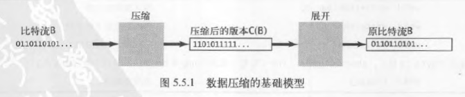

# 数据压缩
能够有效表达数据的算法在现代计算机基础架构中有着重要的地位

数据压缩的主要意义：
- 节省保存信息所需的空间
- 节省传输信息所需的时间

大多数数据文件都会有冗余
- 文本文件中某些字符串出现的频率远远高于其它字符串
- 用来编码图片的位图文件中可能有大片的同质区域
- 保存数字图像、电影、声音等其他类似信号的文件都含有大量重复的模式

任何数据压缩算法的效果都十分依赖于输入的特征

对于数据压缩，性能指代的是算法的压缩率，同时也考虑压缩用时

## 游戏规则
现代计算机系统能处理的所有类型的数据最终都是用二进制表示的，因而可以将其看作一串比特（或字节）的序列

比特流或字节流可以是保存在计算机中的文件，也可以是互联网上传输的一条信息

## 基础模型
数据压缩的基础模型主要由两部分组成
- 压缩盒，能够将一个比特流`B`转化为压缩后的版本（`C(B)`）
- 展开盒，能够将`C(B)`转化回`B`

压缩率指的是$|C(B)|/|B|$，其中$|B|$表示比特流中比特的数量

### 无损压缩
这种模型称为无损压缩模型——保证不丢失任何信息，即压缩和展开后的比特流必须与原始比特流完全相同

数值数据和可运行的代码需要使用无损压缩

### 有损压缩
有损压缩的解码器产生的输出只是与原输入文件近似

有损压缩的评价标准不止有压缩率，还有主观的质量感受

## 局限
#### 通用数据压缩
命题
- 不存在能够压缩任意比特流的算法
- 最优数据压缩是一个不可判定的问题

无损压缩算法必须尽量利用被压缩的数据流中的已知结构
- 小规模的字母表
- 较长的连续相同的位或字符
- 频繁使用的字符
- 较长的连续重复的位或字符

## 游程编码
针对含有短游程数相对较少的长比特流
- 应该使用多少比特来记录游程的长度？
  游程长度应该在0-255之间，使用8位编码
- 当某个游程的长度超过了能够记录的最大长度时怎么办？
  在需要的情况下使用长度为0的游程来保证所有游程的长度均小于256
- 当游程的长度所需的比特数小于记录长度的比特数时怎么办？
  此种情况可能出现，但此处不考虑

只有游程的长度大于将它们用二进制表示所需的长度时才能节省空间

游程编码广泛用于位图的主要原因是，随着分辨率的提高，它的效果也会大大地提高

## 霍夫曼编码
霍夫曼编码能大幅度压缩自然语言文件的空间

它的主要思想是，通过用较少的比特表示出现频繁的字符，而用较多的比特表示偶尔出现的字符，使得总比特数降低来节省空间

### 变长前缀码
和每个字符所相关联的编码都是一个比特字符串，就好像有一个以字符为键，以比特字符串为值的符号表一样

如果所有字符编码都不会成为其他字符编码的前缀，就不需要分隔符了，这样的编码称为前缀码

所有前缀码的解码方式都是唯一的，因此前缀码被广泛应用，7位ASCII也是前缀码

### 前缀码的单词查找树
表示前缀编码的一种简便方法是使用单词查找树

任意含有M个空链接的单词查找树都为M个字符定义了一种前缀码方法：将空链接替换为指向叶子结点的链接，每个叶子结点都含有一个需要编码的字符

寻找最优前缀码的方法由D.Huffman发现于1952年

使用前缀码进行数据压缩需要经过5个主要步骤，将代编码的比特流看作一个字节流并按照以下方式进行前缀码
- 构造一棵编码单词查找树
- 将该树以字节流的形式写入输出以供展开时使用
- 使用该树将字节流编码为比特流

在展开时需要
- 读取单词查找树（保存在比特流的开头）
- 使用该树将比特流解码

### 单词查找树的结点
### 使用前缀码展开
### 单词查找树的构造
