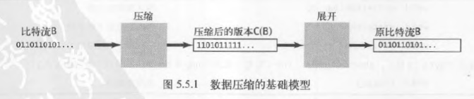

# 数据压缩
能够有效表达数据的算法在现代计算机基础架构中有着重要的地位

数据压缩的主要意义：
- 节省保存信息所需的空间
- 节省传输信息所需的时间

大多数数据文件都会有冗余
- 文本文件中某些字符串出现的频率远远高于其它字符串
- 用来编码图片的位图文件中可能有大片的同质区域
- 保存数字图像、电影、声音等其他类似信号的文件都含有大量重复的模式

任何数据压缩算法的效果都十分依赖于输入的特征

对于数据压缩，性能指代的是算法的压缩率，同时也考虑压缩用时

## 游戏规则
现代计算机系统能处理的所有类型的数据最终都是用二进制表示的，因而可以将其看作一串比特（或字节）的序列

比特流或字节流可以是保存在计算机中的文件，也可以是互联网上传输的一条信息

## 基础模型
数据压缩的基础模型主要由两部分组成
- 压缩盒，能够将一个比特流`B`转化为压缩后的版本（`C(B)`）
- 展开盒，能够将`C(B)`转化回`B`

压缩率指的是$|C(B)|/|B|$，其中$|B|$表示比特流中比特的数量

### 无损压缩
这种模型称为无损压缩模型——保证不丢失任何信息，即压缩和展开后的比特流必须与原始比特流完全相同

数值数据和可运行的代码需要使用无损压缩

### 有损压缩
有损压缩的解码器产生的输出只是与原输入文件近似

有损压缩的评价标准不止有压缩率，还有主观的质量感受

## 读写二进制数据 