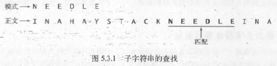
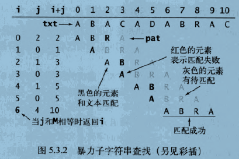
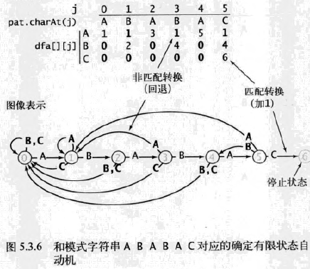
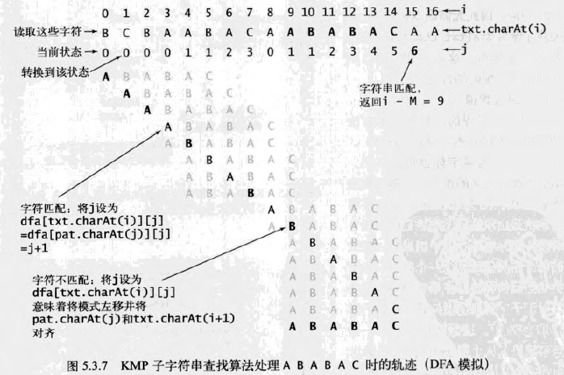
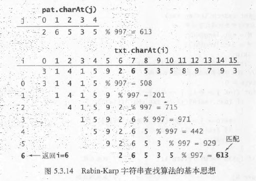
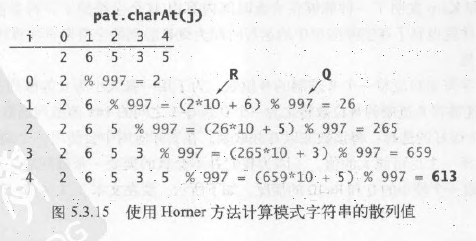

# 字符串查找
## 定义
给定一段长度为N的文本和一个长度为M的模式（pattern）字符串，在文本中找到一个和该模式相符的字符串

### 特点
N >> M

## 衍生问题
- 找出文本中所有和该模式相符的子字符串
- 统计该模式在文本中的出现次数
- 找出上下文（和该模式相符的子字符串周围的文字）

## 应用
- 在文本编辑器中查找某个单词
- 在截获的通信内容中寻找某种重要的模式
## 暴力字符串查找算法
在文本中模式可能出现匹配的任何地方检查是否存在

### 实现一
用一个变量`i`跟踪文本，一个变量`j`跟踪模式。对于每个`i`，首先将`j`重置为`0`，并逐渐增大，直至找到了一个不匹配的字符或是模式结束

见[violent_search.go:ViolentSearch1(txt, pattern string) int](violent_search.go#ViolentSearch1)

### 实现二
用一个变量`i`跟踪文本，一个变量`j`跟踪模式。首先将`j`重置`0`，对于每个`i`，逐渐增大`j`，直至找到了一个不匹配的字符或是模式结束。如果`i`和`j`位置指向的字符不匹配了，那么需要回退这两个变量的值：将j重新指向模式的开头（0），将`i`指向本次匹配开始位置的下一个位置

见[violent_search.go:ViolentSearch2(txt, pattern string) int](violent_search.go#ViolentSearch2)

## KMP字符串查找算法
KMP算法的主要思想是提前判断如何重新开始查找，而这种判断只取决于模式本身
### 模式指针的回退
在KMP算法中，不会回退文本指针`i`，而是使用一个数组`dfa[][]`来记录匹配失败时模式指针`j`应该回退多远

对于每个字符`c`，在比较了`c`和`pattern[j]`之后，`dfa[c][j]`表示的是应该和下个文本字符比较的模式字符的位置
  - 在匹配时，会继续比较下一个字符，因此`dfa[pattern[j]][j]`总是`j+1`
  - 在不匹配时，不仅可以知道`txt[i]`的字符，也可以知道正文中的前`j-1`个字符，它们就是模式中的前`j-1`个字符（因为前`j-1`个文本字符和模式字符匹配）

### 查找过程
这个过程可以理解为：
将模式字符串覆盖在文本字符串上，然后从左至右滑动模式字符串直到所有重叠的字符都相互匹配（或者没有相匹配的字符）

只要计算出了`dfa[][]`数组，当i和j所指向的字符匹配失败时，模式可能匹配的下一个位置应该从`i-dfa[txt[j]][j]`处开始

按照算法，从该位置开始的`dfa[txt[j]][j]`个字符应该相同，因此无需回退指针，只需将`j`设为`dfa[txt[i]][j]`并将`i+1`，即可，而这正是当`i`和`j`所指向的字符匹配时的行为

### DFA模拟
该过程可以用一个确定有限自动机的运行过程来描述

`dfa[][]`数组定义的正是一个确定有限状态自动机

下图显示其由状态（带圆圈的数字）和转换（带标签的箭头）组成

模式中的每个字符都对应着一个状态，每个此类状态能够转换为字母表中的任意字符

还包括了一个不会进行任何转换的停止状态`M`

对于字符串查找问题，在图示的DFA中，这些转换中只有一条是匹配转换（从`j`到`j+1`，标签为`txt[j]`），其他的都是非匹配转换

所有的状态都和字符的比较相对应，每个状态都表示一个模式字符串的索引值

从状态`0`开始，自动机每次从左向右从文本中读取一个字符并移动到一个新的状态，
  - 如果自动机到达了状态M，那么就是在文本中找到了和模式相匹配的一段子字符串，即称为自动机识别了该模式
  - 如果自动机在文本结束时都未能到达状态M，那么就可以知道文本中不存在匹配该模式的子字符串

每个模式字符串都对应着一个自动机（由保存了所有转换的`dfa[][]`数组表示）

KMP的字符串查找方法Search只是一段模拟自动机运行的程序

### 如何计算给定模式相对应的dfa[][]数组？
当`pattern[j]`处匹配失败时，需要将`dfa[][]`转移至适当的状态，相当于回退了文本指针并将模式右移若干位后重新扫描已知的文本字符

因为需要扫描的字符正是在`pattern[1]`到`pattern[j-1]`之间，而这些模式中的字符都是已知的，因此对于每个可能的位置都可以预先找到重启DFA的正确状态

因为在计算`DFA`的第`j`个状态时只需要知道`DFA`是如何处理前`j-1`个字符的，所以总能从尚不完整的`DFA`中得到所需的信息

令`X`为处理`dfa[][]`的第`j`列时的重启位置，因为`X < j`，所以可以得到`X = dfa[pattern[j]][X]`

综上，对于每个`j`
- 若匹配失败，则`dfa[][j] = dfa[][X]`
- 若匹配成功，则`dfa[][j] = j+1`
- 更新`X = dfa[pattern[j]][X]`

### 性能
KMP算法为最坏情况提供的线性级别运行时间保证是一个重要的理论成果。
#### 命题
对于长度为M的模式字符串和长度为N的文本，KMP算法访问的字符不会超过M+N个

在计算dfa[][]时，算法会访问模式字符串中每个字符一次，在Search方法中会访问文本字符串中每个字符一次（最坏情况）

构造DFA所需要的总时间和空间与MR（R为字母表的长度）成正比

在实际应用中，它比暴力算法的速度优势并不十分明显，因为极少有程序需要在重复性很高的文本中查找重复性很高的模式

该方法的一个优点是不需要在输入中回退，这使其适合在长度不确定的输入流中进行查找

## BM字符串查找算法
### 背景
当可以在文本字符串中回退时，如果可以从右至左地扫描模式字符串并将它和文本匹配，那么就能得到一种非常快的字符串查找方法

#### 例如
在查找子字符串BAABBAA时，如果匹配了第7个和第6个字符，但在第5个字符处匹配失败，那就可以马上将模式向右移动7个位置，并继续验查文本中的第14个字符

### 原理
#### 预处理
根据模式字符串构造一张每个字符在在模式中出现的最右位置的表格
#### 查找
查找算法会从右向左扫描模式字符串，并在匹配失败时通过跳跃将文本中的字符和它在模式字符串中出现的最右位置对齐

### 性能
完整的BoyerMoore算法预计算了模式字符串与自身的不匹配情况，并为最坏情况提供了线性级别的运行时间保证

#### 命题
在一般情况下，对于长度为N的文本和长度为M的模式字符串，使用了`Boyer-Moore`字符串查找算法通过启发式处理不匹配的字符需要$\sim N/M$次字符比较

## Rabin-Karp指纹字符串查找算法
它的基础是散列，它计算了模式字符串的散列值，并在文本中查找该散列值的匹配
### 基本思想
长度为M的字符串对应着一个R进制的M位数，为了用一张大小为Q的散列表来保存这种类型的键，需要一个能够将R进制的M位数转化为一个0到Q-1之间的int值散列函数

除留取余法是一个很好的选择：将该数除以Q并取余

在实际应用中会使用一个随机的素数Q，在不溢出的情况下选择一个尽可能大的值

#### 示例

### 计算散列函数
对于5位的值，只需要使用int值即可完成所需的计算，但如果M是100或者1000怎么办呢？

此处使用Horner方法，对于这个数中的每一位数字，将散列值乘以R，加上这个数字，除以Q并取其余数

#### 示例

### 关键思想
Rabin-Karp算法的基础是对于所有位置i，高效计算文本中i+1位置的字符串散列值

这可以由一个简单的数学公式得到：文本t中起始于i位置的含有M个字符的子字符串所对应的数即为
$$
    x[t] = t[i]R^{M-1} + t[i+1]R^{M-2} +...+ t[i+M-i]R^{0}
$$
假设已知$h(x_i) = x_i \ mod \ Q$，将模式字符串右移一位即等价于将$x_i$替换为
$$
  x_{i+1} = (x_i - t[i]R^{M-1})R + t[i + M] 
$$
即将它减去第一个数字的值，乘以R，再加上最后一个数字的值

这么做的结果是无论M是5、100还是1000，都可以在常数时间内高效地不断向右一格一格移动

#### 实现

#### 性能
- 使用蒙特卡洛算法的Rabin-Karp子字符串查找算法的运行时间是线性级别的且出错概率极小
- 使用拉斯维加斯算法的Rabin-Karp子字符串查找算法能够保证正确性，且性能极其接近线性级别
  
Rabin-Karp字符串查找算法也成为指纹字符串查找算法，因为它只用了极少量信息就表示了（可能非常大的）模式字符串，并在文本中寻找它的指纹（散列值）。

算法的高效性来源于指纹的高效计算和比较
## 总结
<table border="4">
  <caption>各种字符串查找算法的实现的成本总结</caption>
  <thead>
    <tr>
      <th rowspan = "2">算法</th>
      <th rowspan = "2">版本</th>
      <th colspan = "2" style="text-align:center" >操作次数</th>
      <th rowspan = "2" style="text-align:center" >在文本中回退</th>
      <th rowspan = "2" style="text-align:center" >正确性</th>
      <th rowspan = "2" style="text-align:center" >额外的空间需求</th>
    </tr>
    <tr>
      <th >最坏情况</th>
      <th >一般情况</th>
    </tr>
  </thead>
  <tbody>
    <tr>
      <td>暴力算法</td>
      <td style="text-align:center">-</td>
      <td>MN</td>
      <td>1.1N</td>
      <td>是</td>
      <td>是</td>
      <td>1</td>
    </tr>
    <tr>
      <td rowspan = "3">Knuth-Morris-Pratt算法</td>
      <td>完整的DFA</td>
      <td>2N</td>
      <td>1.1N</td>
      <td>否</td>
      <td>是</td>
      <td>MR</td>
    </tr>
    <tr>
      <td>仅构造不匹配的状态转换</td>
      <td>3N</td>
      <td>1.1N</td>
      <td>否</td>
      <td>是</td>
      <td>M</td>
    </tr>
    <tr>
      <td>完整版本</td>
      <td>3N</td>
      <td>N/M</td>
      <td>是</td>
      <td>是</td>
      <td>R</td>
    </tr>
    <tr>
      <td >Boyer-Moore算法</td>
      <td >启发式的查找不匹配的字符</td>
      <td>MN</td>
      <td>N/M</td>
      <td>是</td>
      <td>是</td>
      <td>R</td>
    </tr>
    <tr>
      <td rowspan = "2">Rabin-Karp算法</td>
      <td >拉斯维加斯算法</td>
      <td>7N*</td>
      <td>7N</td>
      <td>是</td>
      <td>是</td>
      <td>1</td>
    </tr>
    <tr>
      <td>蒙特卡洛算法</td>
      <td>7N</td>
      <td>7N</td>
      <td>否</td>
      <td>是*</td>
      <td>1</td>
    </tr>

  </tbody>
  <tfoot>
    <tr>
        <td colspan = "7">* 概率保证，需要使用均匀和独立的散列函数</td>
    </tr>
  </tfoot>
</table>