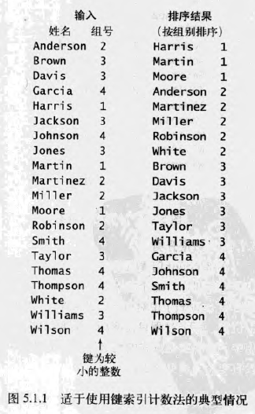
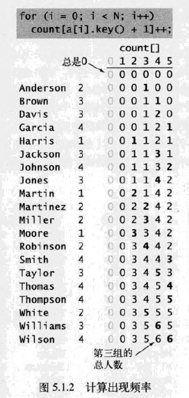
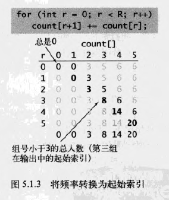
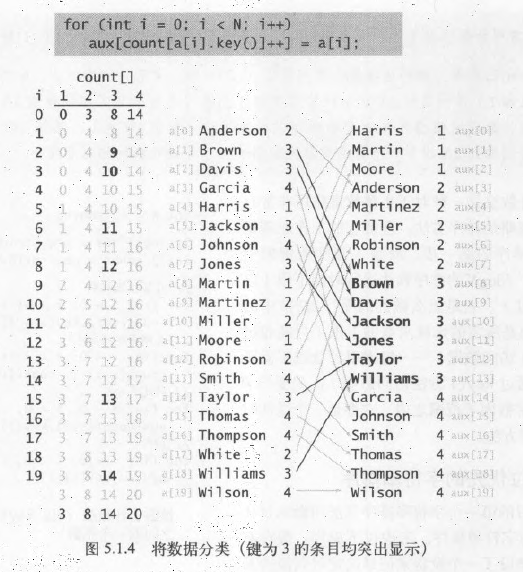
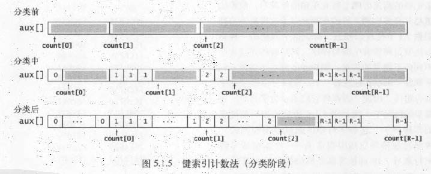
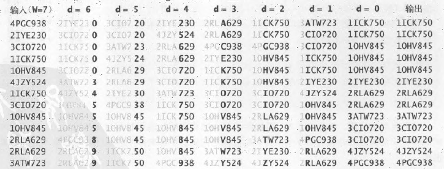
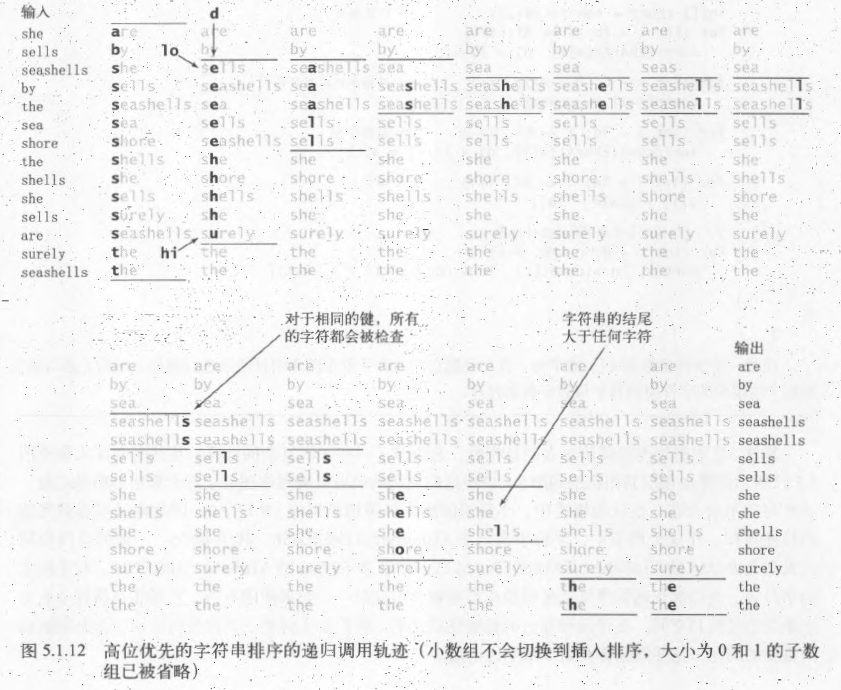

# 字符串排序算法
许多排序应用，决定顺序的键都是字符串，利用字符串的特殊性质，可以得到一些比通用排序算法效率更高的排序算法
## 键索引计数法
一种适用于小整数键的简单排序算法，同时也是后序字符串排序算法的基础

### 用例
老师在统计学生的分数时可能会遇到如下数据处理问题。学生被分为若干组，标号1、2、3等。在某些情况下，希望将全班同学按组分类。因为组的编号是较小的整数，使用键索引计数法来排序是很合适的，见下图

假设数组`a[]`中的每个元素都保存了一个名字和一个组号，其中组号在`0~R-1`之间,，代码`a[i].key()`会返回指定学生的组号

这种方法有四个步骤
### 频率统计
第一步是使用`int`数组`count[]`统计每个键出现的频率。

对于数组中的每个元素，都使用它的键访问`count[]`中的相应元素并将其加`1`
### 将频率转换为索引
接下来，使用count[]来计算每个键在排序结果中的起始索引的位置

一般来说，任意给定的键的起始索引均为所有较小的键所对应的出现频率之和

对于每个键值`r`，小于r+1的键的频率之和为小于r的键的频率之和加上count[r]
### 数据分类
在将`count[]`数组转换为一张索引表后，将所有元素（学生）移动到一个辅助数组`aux[]`中以进行排序

每个元素在`aux[]`中的位置由它的键（组别）对应的`count[]`值决定，在移动之后将`count[]`中对应的元素的值加`1`，以保证`count[r]`总是下一个键为r的元素在`aux[]`中的索引位置

这个过程只需遍历一遍数据即可产生排序结果

这种排序方式具有稳定型，键相同的元素在排序后会被聚集到一起，但相对顺序没有发生变化
### 回写
因为在将元素移动到辅助数组的过程中完成了排序，所以最后一步是将排序的结果复制回原数组中

## 低位优先（LSD）的字符串排序
从右到左检查键中的字符，最适合于键的长度都相同的字符串排序应用

如果字符串的长度均为W，那就从右向左以每个位置的字符作为键，用索引计数法将字符串排序W遍

### 应用
- 老式的卡片打孔排序机
- 扑克牌排序
  将所有牌（按大小）分成13堆，按顺序从13堆牌中抽取同样花色的扑克牌，最后将13堆牌变为4堆（按花色）
  分牌的过程是稳定的，因此花色中的牌也是有序的

## 高位优先（MSD）的字符串排序
从左到右检查键中的字符，首先查看的是最高位的字符。

不一定需要检查所有的输入就可以完成排序。

一个通用的字符串排序算法应该能处理长度不一样的字符串，可以考虑从左向右遍历所有字符
### 原理
- 首先从用键索引计数法将所有字符串按照首字母排序，然后递归地再将每个首字母对应的子数组排序（忽略首字母，因为每一类中所有字符串的首字母都是一样的）
- 和快速排序一样，高位优先的字符串排序会将数组切分为能独立排序的子数组来完成排序任务，但它的切分会为每个首字母得到一个子数组，而非快速排序那样产生固定的两个或三个切分

### 对字符串末尾的约定
在高位优先的字符串排序算法中，要特别注意到达字符串末尾的情况。在排序中，合理的做法是将所有字符都已被检查过的字符串所在的子数组排在所有子数组的前面，这样就不需要递归地将该子数组排序

- 使用一个`charAt()`方法来将字符串中字符索引转化为数组索引，当指定的位置超过了字符串的末尾时返回`-1`。

- 然后将所有的返回值加`1`，得到一个非负的`int`值并用它作为`count[]`的索引

这种转换意味着字符串中的每个字符都可能产生R+1中不同的值：
- `0`表示字符串的结尾
- `1`表示字母表的第一个字符
- `2`表示字母表的第二个字符，等等 

<table border="4">
  <caption>高位优先的字符串排序中`count[]`数组的意义如下</caption>
  <thead>
    <tr>
      <th rowspan = "2">第d个字符排序的完成阶段</th>
      <th colspan = "5" style="text-align:center" >count[r]的值</th>
    </tr>
    <tr>
      <th >r=0</th>
      <th >r=1</th>
      <th >r在2与R-1之间</th>
      <th >r=R</th>
      <th >r=R+1</th>
    </tr>
  </thead>
  <tbody>
    <tr>
      <td>频率统计</td>
      <td>0（未使用）</td>
      <td>长度为d的字符串数量</td>
      <td colspan = "3">第d个字符的索引值是r-2的字符串的数量</td>
    </tr>
    <tr>
      <td>将频率转化为索引</td>
      <td>长度为d的字符串的子数组的起始索引</td>
      <td colspan = "3">第d个字符的索引值是r-1的字符串的子数组的起始索引</td>
      <td>未使用</td>
    </tr>
    <tr>
      <td rowspan = "2">数据分类</td>
      <td colspan = "3">第d个字符的索引值是r的字符串的子数组的起始索引</td>
      <td colspan = "2">未使用</td>
    </tr>
    <tr>
      <td >1+长度为d的字符串的子数组的结束索引</td>
      <td colspan = "3">1+第d个字符串的索引值是r-1的字符串的子数组的结束索引</td>
      <td>未使用</td>
    </tr>
  </tbody>
</table>

### 指定的字母表
高位优先的字符串排序的成本与字母表中的字符数量有很大的关系

可以令排序算法接受一个`Alphabet`对象作为参数，以期改进基于较小字母表的字符串排序程序的性能

- 在构造函数中用一个`alpha`对象保存字母表
- 在构造函数中将`R`设为`alpha.R()`
- 在字符串字符索引方法中将`s[d]`替换为`alpha.toIndex(s[d])`

### 性能
对于高位优先的字符串排序算法，键的顺序并不重要，
高位优先的字符串排序算法的性能取决于数据
## 三向字符串快速排序
可以根据高位优先的字符串排序算法改进快速排序，根据键的首字母进行三向切分，仅在中间子数组中的下一个字符继续递归排序

三向字符串快速排序只将数组切分为三部分，因此当相应的高位优先排序所产生的非空成分较多时，它需要移动的数据量就会变大，因为它需要进行一系列的三向切分才能取得多向切分的效果

但是，高位优先的字符串排序可能会创建大量（空）子数组，而三向字符串快速排序的切分总是只有三个。

三向字符串快速排序能较好地处理以下高位优先字符串排序不擅长的各种情况
- 含有大量等值键
- 有较长公共前缀的键
- 键的取值范围较小
- 切分过程中产生大量小数组

三向字符串快速排序不需要额外的空间，仅需要递归所需的隐式栈
## 字符串排序算法的选择