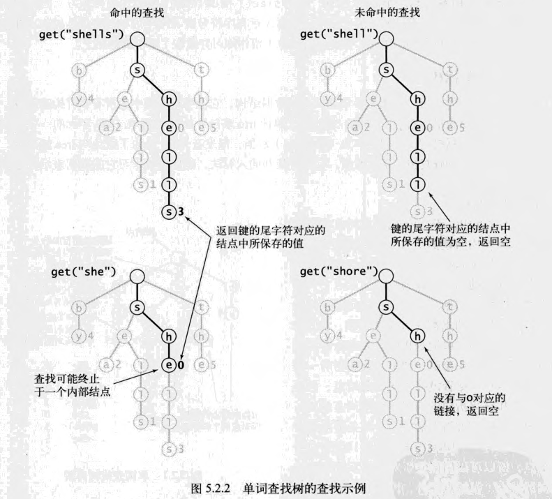

# 单词查找树

## 基本性质
单词查找树由链接的结点组成，每个结点含有一个相应的值，可以是空，也可以是符号表中的某个键所关联的值

每个键所关联的值保存在该键的最后一个字符所对应的结点中

在单词查找树中，键由从根结点到含有非空值的结点的路径所隐式表示
## 查找操作
在单词查找树中查找给定字符串键所对应的值的过程如下：从根节点开始，首先经过的是键的首字符所对应的链接；在下一个结点中沿着第二个字符所对应的链接继续前进，如此这般直到到达最后一个字符所指向的结点，或是遇到一条空链接。

此时可能会出现以下3种情况
- 键的尾字符所对应的结点中的值非空，这是一次命中的查找
  ——键所对应的值就是键的尾字符所对应的结点中保存的值
- 键的尾字符所对应的结点中的值为空，这是一次未命中的查找
- 查找结束语一条空链接，这也是一次未命中的查找



## 插入操作
在插入之前要进行一次查找，可能会出现两种情况：
- 在达到键的尾字符之前就遇到了一个空链接，这种情况下字
  符查找树中不存在与键的尾字符对应的结点，因此需要为键中还未检查的每个字符创建一个对应的结点并将键的值保存到最后一个字符的结点中
- 在遇到空链接之前就到达了键的尾字符，这种情况下将该结点的值设为键所对应的值

在所有情况下，都会检查键中的每个字符并为它们在树中创建一个对应的结点

## 结点的表示
每个结点都含有R个链接，对应着每个可能出现的字符

## 大小
size()的实现有三种选择
### 即时实现
用一个实例变量size保存键的数量
### 更即时的实现
用结点的实例变量size保存子单词查找树中键的数量，在递归的`put()`和`delete()`方法调用之后更新它们
### 延时递归实现
遍历单词查找树中的所有结点并记录非空值结点的次数

## 实现方式
### trie结构内含node结构
#### 使用数组
```go
// trie代表单词查找树
type trie struct {
  root *node
}

// node代表单个结点
type node struct {
	size int
	next [R]*node
	val  any
}
```
#### 使用slice
```go
// trie代表单词查找树
type trie struct {
  root *node
}

// node代表单个结点
type node struct {
	size int
	next []*node
	val  any
}
```
#### 使用map
```go
// trie代表单词查找树
type trie struct {
  root *node
}

// node代表单个结点
type node struct {
	size int
	next [rune]*node
	val  any
}
```
### Trie结构内含*Trie结构
```go
type trie struct {
  size int
  next [R]*trie //R棵子单词查找树
  val any
}
```

<table border="4">
  <caption>单词查找树的不同实现方式</caption>
  <thead>
    <tr>
      <th rowspan = "2">方式</th>
      <th colspan = "5" style="text-align:center" >count[r]的值</th>
    </tr>
    <tr>
      <th >r=0</th>
      <th >r=1</th>
      <th >r在2与R-1之间</th>
      <th >r=R</th>
      <th >r=R+1</th>
    </tr>
  </thead>
  <tbody>
    <tr>
      <td>频率统计</td>
      <td>0（未使用）</td>
      <td>长度为d的字符串数量</td>
      <td colspan = "3">第d个字符的索引值是r-2的字符串的数量</td>
    </tr>
    <tr>
      <td>将频率转化为索引</td>
      <td>长度为d的字符串的子数组的起始索引</td>
      <td colspan = "3">第d个字符的索引值是r-1的字符串的子数组的起始索引</td>
      <td>未使用</td>
    </tr>
    <tr>
      <td rowspan = "2">数据分类</td>
      <td colspan = "3">第d个字符的索引值是r的字符串的子数组的起始索引</td>
      <td colspan = "2">未使用</td>
    </tr>
    <tr>
      <td >1+长度为d的字符串的子数组的结束索引</td>
      <td colspan = "3">1+第d个字符串的索引值是r-1的字符串的子数组的结束索引</td>
      <td>未使用</td>
    </tr>
  </tbody>
</table>